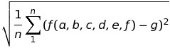

# YellowCol

The goal of this project is to find an equation which, from columns A B C D E F of an excel file, finds column G.

The evaluation function is the standard deviation on all points



## Circle-CI

[](https://circleci.com/gh/PamplemousseMR/YellowCol/tree/master)

## Getting Started

These instructions will get you a copy of the project up and running on your local machine for development and testing purposes.

### Prerequisites

- [easea](http://easea.unistra.fr/index.php/EASEA_platform) : An Artificial Evolution platform that allows to implement evolutionary algorithms and to exploit the massive parallelism of many-core architectures.

### Compilation

Generate the project by using easea : `./easea YellowCol.ez`.

Apply the patch : `./hack.sh`.

Compile using the makefile : `make`.

```
- easeaclear : Clean previous compilation.
```

### Use

Start the program  : `./YellowCol`.

## Result

Our best result is 9.33e-02 with this generated function :
```
(min(min(min(F,min((ceil(tan(log(F)))-min(((0.0438715*C)+(C/max(sqrt(0.436188),max(sqrt(0.398541),((min(((inv(F)*F)+max(((F-0.719514)/(min(min(pow(pow((E+floor(D)),A),(E/min((max(A,D)+(max((F-A),((C+((((F+pow(B,(C/(E/A))))+((F-0.719514)+E))*inv(F))*E))+((C+cos(A))*(C+exp(D)))))/0.936366)),(abs(max(((((min(((E/(C/(E/A)))+D),F)+max(exp(D),max(F,0.476771)))-((0.413874-C)*0.456263))/E)+(C/pow(sqrt(0.398541),((min((((min((pow((F-cos(A)),E)+cos((((((E*pow((max(max(A,inv(F)),sin(F))-abs(A)),E))+pow(((max(((min(B,min(pow(C,E),sin(F)))/(C/(C/A)))+B),cos(D))*F)*pow((F-cos(A)),E)),(C*max((max((F-0.719514),(((C*pow(D,D))+E)*pow(max((F/pow(F,E)),C),E)))*max(C,0.997384)),(B/E)))))+((A*C)+E))*((C+cos(A))+D))/D))),(pow(max(C,log(F)),(F+F))*sin((E-E))))-pow(D,((exp(square(C))/pow(E,B))+min((pow(max(C,log(F)),(F+F))*sin((E-E))),sin(F)))))*F)+cos((((max((log(F)*pow(B,E)),(F*inv(A)))*max(A,max(A,E)))+F)/D))),(pow(max(B,B),(F+F))*sin((D-E))))-pow(F,max(((inv(F)+0.593318)/A),max(F,0.476771))))+B)))),0.398541))*(C*(A*max(log(A),min(D,(C+cos(D)))))))))),0.915096),pow(max((max((F-0.881888),(min(min((pow(C,A)/(F/max(sin(F),(max((C/D),(F+D))+F)))),max(C,B)),pow(B,(F/B)))/(max((F-A),0.997384)/inv(A))))*((min((E+F),cos(B))/((D-A)/(E/A)))*max((pow(max((tan(0.18221)-0.719514),F),0.719514)-(E-(A+tan(A)))),min(D,(C-cos(D)))))),(B/E)),(B/B)))/((max(max(A,inv(F)),sin(F))-abs(A))/A))),max(max(abs(F),pow(F,A)),0.164423))),(pow(max(B,log(F)),(F+F))*sin((D-E))))*E)/B))))),min(0.754862,log(A)))),(C+(neg(sqrt(0.398541))/((inv(C)-pow(F,(E-E)))+(((D*cos(E))-E)+((((C*pow((B*A),pow(A,D)))+(F+A))*(((((log(F)*pow((pow(max(D,((min((F+F),cos(B))/(C/F))*((pow(max(min(E,0.719514),pow((D-(D-floor(E))),(((((tan(0.18221)*floor(log(A)))*sqrt(0.241543))/ceil(tan(F)))/E)*min(pow((F-0.719514),min(F,(((C-0.719514)-(F/(F+square(F))))+cos(A)))),(((((((min(min(tan(0.18221),floor(tan(F))),(inv(F)/(D-(E+cos(D)))))/ceil(tan(F)))+E)*min(max((F-0.391885),(F/(log(A)+cos(A)))),((min((tan(0.18221)*floor(tan(A))),ceil(C))/ceil(tan(F)))*max((pow(E,0.719514)-(B/(A*tan(A)))),(F-(C+cos(C)))))))*F)*((0.652134+(tan(log(A))/((((max((((min(((((tan(0.18221)*floor(log(A)))*A)/ceil(tan(F)))/E),(floor(tan(F))+(F+F)))/ceil(tan(F)))+E)*min(max((F-0.719514),(F/(log(D)+ceil(A)))),pow(min(C,(0.719514+ceil(A))),max((pow(E,0.719514)+(B/F)),F)))),F)*pow(min(((0.997384-C)-(F/(E+square(F)))),(D+cos(D))),E))+(square(floor(log(F)))*(min(pow(square(ceil(log(F))),A),(max((F-E),min(C,E))*ceil(A)))*cos(D))))*pow(min(((max(min(B,(0.997384*sqrt(D))),min(ceil(tan(F)),F))+C)/(F-E)),C),E))+min((tan(0.18221)*floor(tan(F))),ceil((D+cos(C)))))))/min(tan(log(F)),(max(F,A)+max((0.997384-C),(C+(C*pow((B*A),pow(D,D)))))))))+(square(ceil(log(F)))*(min(pow(square(ceil(log(F))),A),(max((F+F),min(C,E))*ceil(A)))*cos(D))))*max(((((((min((tan(0.18221)/floor(tan(F))),(inv(F)/(D-(E+cos(D)))))/ceil(tan(F)))+E)*min(max((F-0.391885),(F/(max((F+F),min(C,E))+cos(A)))),((min((tan(0.18221)*floor(min(tan(log(F)),((0.241543/E)+max((0.997384-C),(ceil(tan(F))+(C*pow((B*A),pow(D,D))))))))),ceil((F+cos(C))))/F)*max((pow(E,0.719514)-(B/(A*tan(A)))),(F-(C+cos(C)))))))*F)*((0.652134+(tan(log(A))/((((max((((min((tan(0.18221)*floor(E)),(cos(E)+cos(A)))/ceil(tan(F)))+E)*min(max((F-0.719514),(A+tan(A))),pow(min((square(inv(log(F)))+A),(0.719514+ceil(A))),max((pow(C,0.719514)-0.18221),min(F,(D+cos(C))))))),F)*pow(min(((0.997384-C)-(F/(C+square(F)))),(C+cos(D))),E))+(square(floor(log(F)))*(min(pow(square(ceil(log(F))),A),(max((F+E),min(C,E))*ceil(A)))*cos(D))))*pow(min((max(max(min(B,(0.997384*sqrt(D))),min(0.719514,F)),C)/(F-E)),C),E))+min((tan(0.18221)*floor(tan(F))),ceil((D+cos(C)))))))*min(tan(log(F)),(max(F,A)+max((0.997384-C),(C+(C*pow((B*A),pow(A,D)))))))))+(A*(min(pow(square(ceil(log(F))),A),(A*ceil(A)))*cos(D)))),min(F,(C+cos(C))))))))),0.450037)-(E/(A+tan(A))))-min(D,(C-cos(D)))))),sin((B/E)))-abs(A)),E))+(min((square(0.18221)*floor((((min((tan(0.18221)/floor(tan(F))),(inv(F)/(D-(E+cos(D)))))/ceil(tan(F)))+tan(F))*min(((F-0.719514)+(F+(log(A)+cos(A)))),(A*max(C,(F-(C+cos(C))))))))),C)+((0.241543/E)*max((max((F-0.881888),(min(min((pow(C,A)/(F/max(sin(F),(max(log(F),pow(F,A))+F)))),max(C,B)),pow(B,(F/B)))/(max(pow(F,A),0.997384)+cos(A))))*((min((C+F),ceil(B))/(C/(E/A)))*max((pow(max((C-0.719514),E),0.719514)-(0.719514+(A+tan(A)))),min(D,(C-cos(D)))))),(B/E)))))+((A*A)+E))-max((F-A),((C+min((max(A,E)*(max(pow(F,A),(((min((tan(0.18221)/floor(tan(F))),(inv(F)/(D-(E+cos(D)))))/ceil(tan(F)))+tan(F))*min(((F-0.719514)+(F+(log(A)+cos(A)))),(A*max(C,(F-(C+cos(C))))))))/0.936366)),(A+tan(A))))+min((C+cos(A)),(C+exp(D))))))+D))+D))))))),max((tan(log(A))/ceil(sqrt(log(D)))),max(square(abs(0.915096)),(min(((B-min(D,(D*cos(E))))*max(0.293157,B)),((D-(D-cos(E)))+(((((tan(0.18221)*floor(log(A)))*ceil((cos(E)+cos(A))))/ceil(tan(F)))/E)*min(tan(A),(((((((min((tan(0.18221)/floor(tan(F))),(inv(E)/(D-(E+cos(D)))))/ceil(tan(F)))+E)*min(max((F-0.719514),(F/(log(A)+cos(A)))),((min((tan(0.18221)*floor(tan(A))),inv(log(F)))/ceil(tan(F)))*max(log(A),(F-(C+floor(C)))))))*F)*((0.652134+(tan(log(A))/((((max((((min((tan(0.18221)*floor(D)),log(F))/pow(min((square(inv(log(F)))+(D-cos(E))),F),max((pow(E,0.719514)-(B/F)),min(F,(D+cos(C))))))+E)*min(max((F-0.719514),(F/(log(D)+ceil(A)))),pow(min((square(inv(log(F)))+A),(0.719514+ceil(A))),max((pow(E,0.719514)-(B/F)),min(F,(D+cos(C))))))),E)*pow(min(((0.997384-C)-(F/(C+square(A)))),(C+cos(D))),E))+(square(floor(log(F)))*(min(pow(square(ceil(log(F))),A),(max((F+E),min(C,A))*ceil(A)))*cos(D))))*pow(min((max(max(min(B,(0.997384*sqrt(D))),min(tan(log(F)),F)),C)/(F-E)),sqrt(D)),E))+min((tan(0.18221)*floor(tan(F))),ceil((D+cos(C)))))))*min(tan(log(F)),(max(min((pow(C,A)/(F/max(sin(F),(max(log(F),pow(F,A))+F)))),max(D,B)),A)+max((D-C),(C*(C*pow((B*A),pow(A,D)))))))))+(square(ceil(log(F)))*(min(pow(square(ceil(log(F))),A),(max((F+F),min(A,E))*ceil(A)))*cos(D))))*max((pow(E,0.719514)-(A/(min(pow(square(ceil(log(F))),A),(max((D+F),(C+E))*ceil(A)))+tan(A)))),min(F,(C+cos(C)))))))))+((D*E)+log(B)))))),((0.664468+(tan(log(A))/((((((((min((tan(0.18221)*floor(((((((((((min((tan(0.18221)*floor(tan(F))),ceil((D*cos(C))))/ceil(tan(F)))+E)*min(max((F-0.719514),(F/(log(A)+ceil(A)))),(F*max((pow(E,0.719514)-(B/(A/tan(A)))),min(F,(D+cos(C)))))))*F)*pow(min(min((max(max(min(square(ceil(log(F))),(0.997384+sqrt(D))),min(E,F)),E)/(F-E)),sqrt(D)),(C+cos(D))),E))+(square(ceil(log(F)))*(min(pow(tan(ceil(log(F))),A),(max((F+F),min(C,E))*ceil(A)))*cos(D))))*pow(min((max(max(min(B,(0.997384+sqrt(D))),min(F,F)),C)/(F-E)),C),E))+(neg(tan(neg(F)))+E))*pow(min(min((max(max(min(B,(tan(log(F))+sqrt(D))),min(E,F)),E)/(F-E)),D),(C+cos(D))),E))+(square(ceil(log(F)))*(min(pow(square(ceil(log(F))),A),(D*ceil(A)))*cos(D)))))),ceil((D*cos(C))))/ceil(tan(F)))+E)*min(max((F-0.719514),(F/(log(A)+ceil(A)))),(F*max((pow(E,0.719514)-(B/(A/tan(A)))),min(F,(D+cos(C)))))))*F)*pow(min(min((max(max(min(square(ceil(log(F))),(0.997384+sqrt(D))),min(E,F)),E)/((F-E)-E)),D),F),E))+(square(ceil(log(F)))*(min(pow(square(ceil(log(F))),A),(max((F+F),min(C,E))*ceil(A)))*cos(D))))*pow(min((max(max(min(B,(0.997384+sqrt(D))),min(tan(log(F)),F)),C)/(F-E)),C),E))+(neg(tan(neg(F)))+E))))*min(min(tan(log(F)),((log(sqrt(log(max(E,B))))*tan(log(F)))+max((0.997384-C),(min(tan(E),D)+(C*pow((B*A),pow(A,B))))))),((log(sqrt(log(max(E,B))))*tan(log(F)))+max((0.997384-C),(C+(C*pow((B*A),pow(A,B)))))))))*((max((0.997384-C),0.476771)*tan(log(F)))*(pow((log(sqrt(log(max(E,B))))*tan(log(F))),((C+min(F,((C+cos(E))+inv(E))))+min(0.961809,(C+cos(D)))))+max(inv(E),(B/F)))))
```

## Authors

* **MANCIAUX Romain** - *Initial work* - [PamplemousseMR](https://github.com/PamplemousseMR).
* **HANSER Florian** - *Initial work* - [ResnaHF](https://github.com/ResnaHF).

## License

This project is licensed under the GNU Lesser General Public License v3.0 - see the [LICENSE.md](LICENSE.md) file for details.